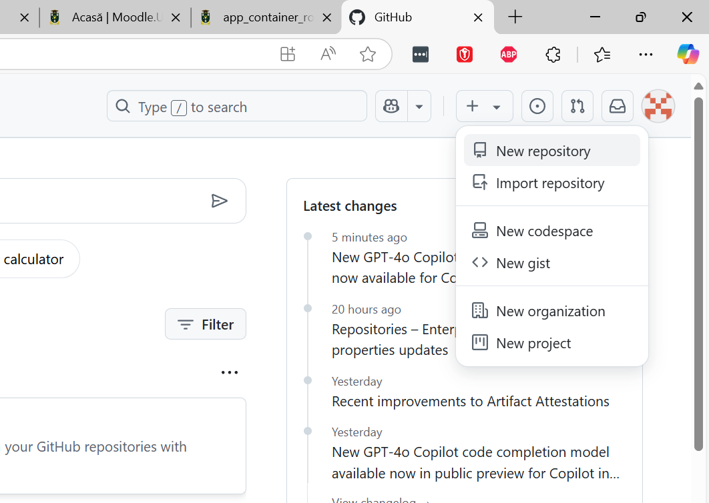
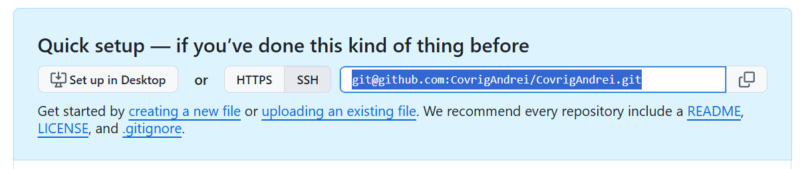
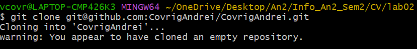

# Lucrare de laborator Nr.2: Lucrul cu GIT
# Covrig Andrei, grupa I2301
# 2025

## Scopul lucrării
Familiarizarea cu sistemul de control al codului GIT.

## Etapele realizării lucrării
### Registrarea contului GitHub

### Crearea unui proiect
După autentificare pe GitHub, în colțul din dreapta sus există un buton `+`. Apăsând pe el, am creat un repozitoriu nou, cu numele de conectare la GITHUB.



### Clonarea repozitoriului pe calculatorul local
Am creat o copie locală a repozitoriului pe care l-am creat. Pentru aceasta am copiat referința repozitoriului.



Am deschis linia de comandă, am navigat în directorul în care am dorit să păstrez proiectul și am executat comanda:

```bash
git clone git@github.com:CovrigAndrei/CovrigAndrei.git
```

Creați o nouă ramură și treceți la ea.

```bash
# create a new branch and switch to
git checkout -B lab01
```
### Crearea structurii fișierelor
În directorul proiectului am adăugat următoarele fișiere:

1. `readme.md` - descrierea proiectului
2. `images` - un director pentru stocarea imaginilor
### Adăugarea descrierii proiectului
În fișierul `readme.md` am adăugat:
1. Salutare
2. Foto / avatar
3. O scurtă descriere a mea
4. Domeniile de interes
5. Limbaje de programare
    - care le cunosc
    - care le învăț
    - care doresc să le învăț
6. Cum pot fi contactat

### Publicarea codului pe GitHub

În directorul repozitoriului, am executat următoarele comenzi din linia de comandă:

```bash
# add all files to tracking
git add *
# check status
git status
# create a commit
git commit -m "structure defined"
# push commit to remote repository
git push
```

## Concluzii.

## Bibliografie.
1. [QEMU virtualization, calculate-linux.org, 2020-01-24](https://wiki.calculate-linux.org/qemu)
2. [Welcome to QEMU’s documentation!, qemu.org](https://www.qemu.org/docs/master/)
3. [virtual machine manager, virt-manager.org](https://virt-manager.org/)