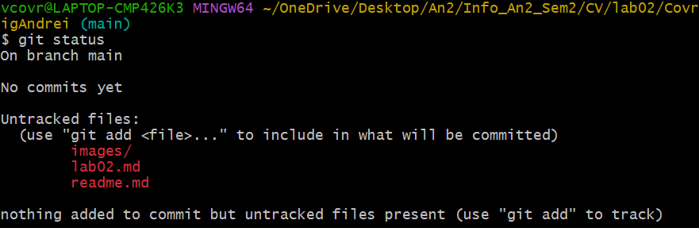
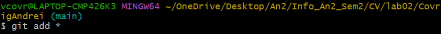
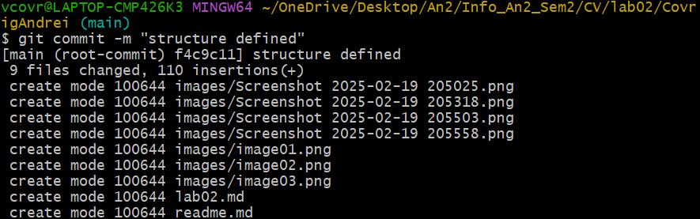
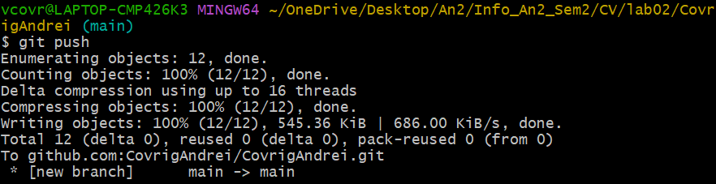

# Lucrare de laborator Nr.2: Lucrul cu GIT
# Covrig Andrei, grupa I2301
# 2025

## Scopul lucrării
Familiarizarea cu sistemul de control al codului GIT.

## Etapele realizării lucrării

### Registrarea contului GitHub
Am accesat site-ul GitHub. Am completat formularul de înregistrare, apoi am apăsat pe butonul `Sing up`. După completarea formularului, am verificat adresa de email prin intermediul unui link trimis de GitHub pe email. După verificare, am setat preferințele contului, apoi am apăsat butonul `Create account` și astfel am creat contul GitHub.

### Crearea unui proiect
După autentificare pe GitHub, în colțul din dreapta sus există un buton `+`. Apăsând pe el, am creat un repozitoriu nou, cu numele de conectare la GitHub.


### Clonarea repozitoriului pe calculatorul local
Am creat o copie locală a repozitoriului pe care l-am creat. Pentru aceasta am copiat referința repozitoriului.


Am deschis linia de comandă, am navigat în directorul în care am dorit să păstrez proiectul și am executat comanda:

```bash
git clone git@github.com:CovrigAndrei/CovrigAndrei.git
```


### Crearea structurii fișierelor
În directorul proiectului am adăugat următoarele fișiere:

1. `readme.md` - descrierea proiectului
2. `images` - un director pentru stocarea imaginilor

### Adăugarea descrierii proiectului
În fișierul `readme.md` am adăugat:
1. Salutare
2. Foto / avatar
3. O scurtă descriere a mea
4. Domeniile de interes
5. Limbaje de programare
    - care le cunosc
    - care le învăț
    - care doresc să le învăț
6. Cum pot fi contactat

### Publicarea codului pe GitHub

În directorul repozitoriului, am executat următoarele comenzi din linia de comandă:
```bash
# check status
git status
```

```bash
# add all files to tracking
git add *
```

```bash
# create a commit
git commit -m "structure defined"
```

```bash
# push commit to remote repository
git push
```


## Concluzii
Git este un sistem de control al versiunilor distribuit, care ne permite să urmărim modificările aduse codului, să colaborăm cu alții și să revenim la versiunile anterioare dacă ceva nu a mers bine. Spre deosebire de sistemele centralizate, Git permite fiecărui utilizator să aibă o copie completă a istoricului proiectului.

## Bibliografie
1. [GitHub Docs, docs.github.com](https://docs.github.com/en)